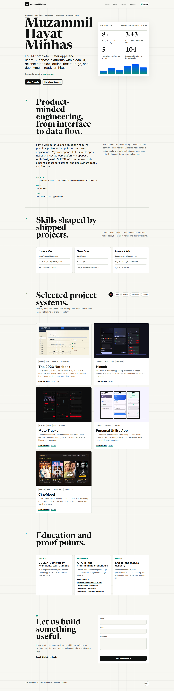
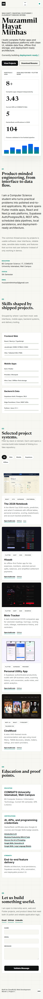

# Muzammil Hayat Minhas - CloudExify Web Project 1

Personal portfolio website for CloudExify Full Stack Web Development Internship 2026, Month 1, Project 1.

## Student Details

- Name: Muzammil Hayat Minhas
- Registration Number: CX-INT-2026-GEN-0195
- Project: Personal Portfolio Website
- Build Track: Glass & Gradient
- Tech Stack: HTML5, CSS3, Vanilla JavaScript

## Signature Features

- Premium animated hero with cinematic intro veil
- Real project preview reel in the first viewport
- Typewriter hero intro
- Scroll progress indicator
- Live theme switcher saved with localStorage
- Scroll-triggered animated skill bars
- Live project filter
- Project detail dialog using JavaScript-rendered data
- Pointer-reactive project cards and cursor glow
- Real project screenshots and GitHub repository links
- Contact form validation
- Smooth scroll and active navigation highlight
- Hidden easter egg badge
- Downloadable resume button
- Coursera and Google Skills certificate links

## Project Structure

```text
portfolio/
|-- index.html
|-- css/
|   `-- style.css
|-- js/
|   `-- script.js
|-- assets/
|   |-- docs/
|   |   |-- Muzammil_Minhas_Resume.docx
|   |   |-- Muzammil_Minhas_Resume.pdf
|   |   `-- certificates/
|   |       |-- coursera-discover-the-art-of-prompting.pdf
|   |       |-- coursera-introduction-to-ai.pdf
|   |       `-- coursera-maximize-productivity-with-ai-tools.pdf
|   `-- images/
|       |-- concept-premium-world.png
|       |-- concept-swiss-editorial.png
|       |-- project-2026-notebook.png
|       |-- project-hisaab.png
|       |-- project-moto-tracker.png
|       |-- project-utility-app.png
|       `-- project-cinemood.png
|-- screenshots/
|   |-- desktop/
|   |   `-- portfolio-desktop.png
|   `-- mobile/
|       `-- portfolio-mobile.png
`-- README.md
```

## Live Link

https://cloudexify-web-p1-muzammilminhas-muzi47.vercel.app

## Screenshots

The repository includes the required desktop and mobile screenshots for CloudExify submission.

| Desktop | Mobile |
| --- | --- |
|  |  |

## Links

- Repository: https://github.com/muzzammilminhas/cloudexify-web-p1-muzammilminhas
- GitHub: https://github.com/muzzammilminhas
- LinkedIn: https://www.linkedin.com/in/muzzammilminhas
- Email: muzzammilminhas5@gmail.com

## Testing Checklist

- Desktop layout tested
- Mobile layout tested
- Hamburger menu opens and closes
- Theme toggle persists after refresh
- Typewriter intro works
- Skill bars animate once on scroll
- Project filters update visible cards
- Project detail dialog opens and closes
- Contact form validates empty and invalid input
- Console has no JavaScript errors
